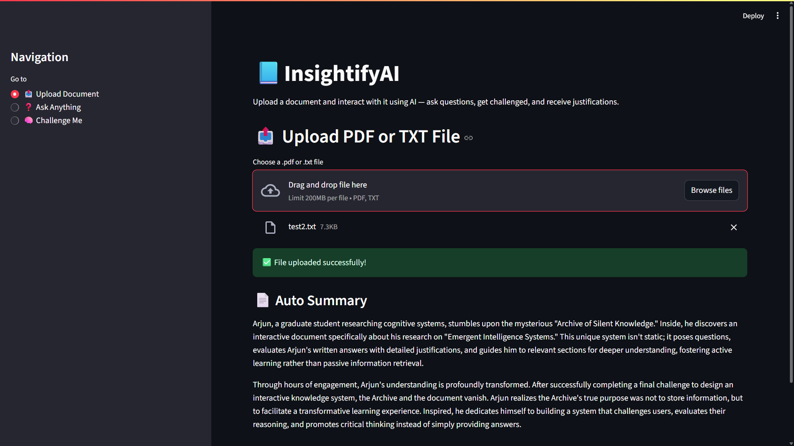
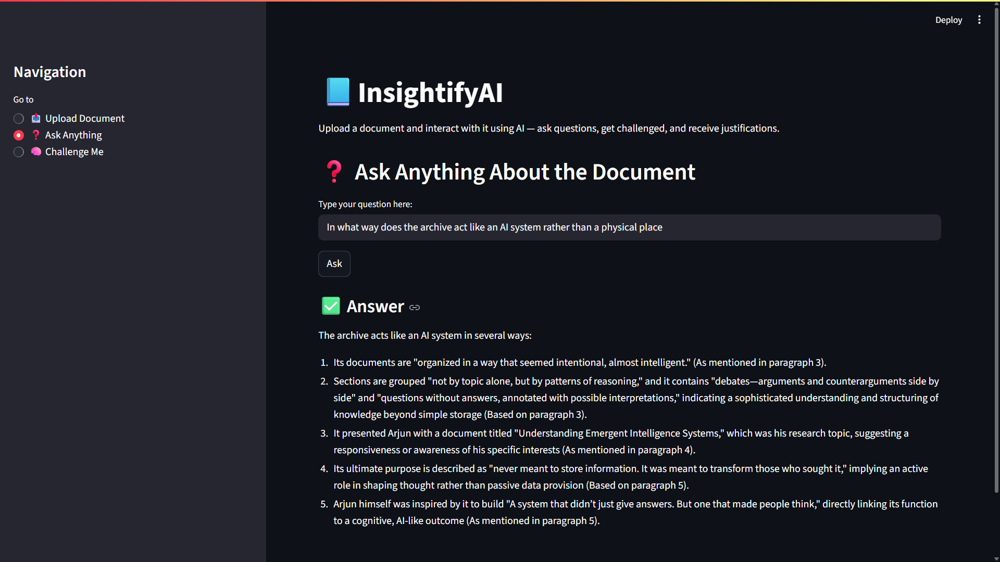
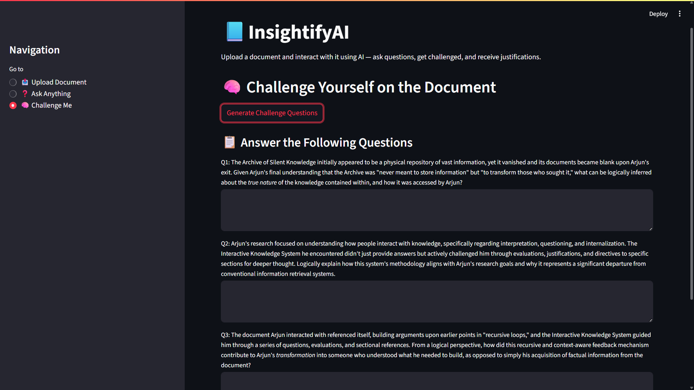

# 📘 Insightify

Insightify is an AI-powered tool that enables users to upload a research document (PDF or TXT) and interact with it intelligently — by asking questions, receiving logic-based challenges, and getting evaluated on their understanding.

---

## 📸 Preview





---

## 🚀 Features

🔍 Document-Aware Understanding
Upload PDF or TXT documents and let Insightify analyze their content for reasoning and summarization.

🧠 Ask Anything
Ask free-form questions. Get answers grounded in the actual document with justification.

🎯 Challenge Me Mode
Insightify generates logic-based questions based on your document and evaluates your answers with reasoning.

📝 Instant Auto Summary
Receive a concise ≤150-word summary right after uploading your document.

🧾 Justified Answers
Each answer includes a reference (e.g., “as stated in section 2…”) to ensure transparency and trust.

---

## ⚙️ Tech Stack

| Component      | Technology               |
| -------------- | ------------------------ |
| Backend API    | FastAPI                  |
| Frontend UI    | Streamlit                |
| Embeddings     | Gemini 2.5 Embedding API |
| LLM Reasoning  | Gemini 2.5 Pro API       |
| Vector DB      | FAISS                    |
| Chunking Logic | LangChain                |
| PDF Parsing    | PyMuPDF                  |

---

## 🏗️ Architecture

1. 🆙 Upload

   * Upload `.pdf` or `.txt` file via the frontend
   * PyMuPDF extracts text → LangChain chunks text

2. 🔎 Embedding + Indexing

   * Chunks embedded using Gemini 2.5 Embedding API
   * Indexed using FAISS (saved locally)

3. 📄 Summarization

   * Entire document summarized using Gemini 2.5 Pro
   * Summary saved and displayed on frontend

4. ❓ Ask Anything

   * User question + top FAISS chunks → passed to Gemini
   * Gemini answers in document context

5. 🧠 Challenge Me

   * Gemini generates 3 logic-based questions
   * User answers are scored, compared with ideal answers
   * Gemini provides explanation and score (1–5)

---

## 💻 How to Use

### 1. Clone the Repo & Setup Environment

```bash
git clone https://github.com/kartikeyp011/Insightify.git
cd Insightify
python -m venv myenv
myenv\Scripts\activate
pip install -r requirements.txt
```

➕ Create a .env file in the project's root folder:

.env

GEMINI\_KEY=your\_gemini\_api\_key

Run the backend from the root folder:

```bash
uvicorn backend.main:app --reload
```

---

### 2. Start Frontend

Run the frontend from the root folder:

```bash
streamlit run frontend/app.py
```

---

### 3. Interact in Browser

* Upload a document → Get auto-summary
* Ask questions → Get AI-generated contextual answers
* Challenge Me → Answer logic questions & receive evaluations

---

## 📫 Postman Collection (API Testing)

A complete Postman collection is included for testing all API endpoints.

📁 Location:
postman/Insightify.postman\_collection.json

This includes:

* POST /api/upload — upload .pdf/.txt
* POST /api/ask — ask a question
* GET /api/challenge — generate logic-based questions
* POST /api/evaluate — evaluate your answers

---

## 🔮 Prompt Engineering Examples

Sample prompt used to generate logic questions:

🧠 generate\_logic\_questions()

You are a university professor evaluating a research paper. Based on the provided context, generate 3 logic-heavy, reasoning-based questions that test whether a student has deeply understood the arguments and implications of the text. Avoid fact-based or simple summary questions. Number them 1., 2., and 3.

Sample prompt for evaluation:

📝 evaluate\_user\_answers()

You are an examiner. Compare the following student answers with ideal responses. For each one:

* Return the original question
* Include the user's answer
* Generate the ideal answer based on the document context
* Score out of 5 based on logic, relevance, and accuracy
* Add a short feedback comment

---

## 🧪 Sample Usage

1. Launch Streamlit UI
2. Upload any PDF/TXT (e.g., paper, report, short story)
3. Review auto-generated summary
4. Use:

   * ❓ Ask Anything → Get contextual answers
   * 🧠 Challenge Me → Answer logic questions & receive scoring

---

## 💡 Example Use Cases

* Academic paper comprehension
* Self-testing for competitive exams
* Evaluating logical reasoning from text
* Research assistants for scholars
* Summarizing dense research content

---

## 📌 Start Commands Summary

All commands should be executed from the **root folder**.

Backend:

```bash
uvicorn backend.main:app --reload
```

Frontend:

```bash
streamlit run frontend/app.py
```

---

✔️ Gemini API Key
You can get this for free via Google AI Studio:
[https://makersuite.google.com/](https://makersuite.google.com/)

---

## 🧑‍⚖️ License

MIT License. See LICENSE file for full terms.

---

## 📬 Contact

Created by Kartikey Narain Prajapati
📧 [kartikeyp011@gmail.com](mailto:kartikeyp011@gmail.com)
🔗 GitHub: github.com/kartikeyp011
🔗 LinkedIn: linkedin.com/in/kartikeyp011/

---